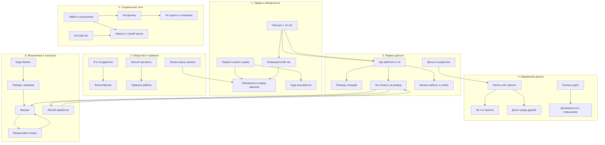

# Отчёт по лабораторной работе «Я и социум»

## Команда

| Участник | Роль |
|----------|------|
| Ворошилов Кирилл (капитан) | Онтология, координация, финальная вёрстка |
| Палаткин Кирилл | SPARQL-запросы, анализ Wikidata |
| Лылина Юлия | Генерация текстов через LLM, стилистика |
| Карнаков Никита | Простановка перекрёстных ссылок |
| Кряж Виолетта | Разработка схемы связей, работа с данными |
| Белякова Евдокия | Интеграция, GitHub Pages |
| Черевичин Егор | Скрипты для concepts.json |

---

## Онтология предметной области

Тема «Я и социум» охватывает взаимодействие подростка (10–14 лет) с обществом, правовые и финансовые аспекты.
Выделено 6 разделов, каждый содержит 5 понятий. Общее количество — **30 понятий**.

### Разделы

| # | Раздел | Понятия |
|---|--------|---------|
| 1 | Мои права и обязанности | Паспорт с 14 лет, Права в школе и дома, Комендантский час, Обязанности перед законом, Куда жаловаться |
| 2 | Моё общество и правила | Зачем нужны законы, Нельзя мусорить, Я и государство, Волонтёрство, Правила района |
| 3 | Мои первые деньги | Где работать в 14, Помощь соседям, Не попасть на развод, Баланс работы и учёбы, Деньги и родители |
| 4 | Мои карманные деньги | Сколько дают, Копить или тратить, На что тратить, Долги среди друзей, Договориться о повышении |
| 5 | Мои социальные сети | Лайки и настроение, Алгоритмы, Блогерство, Зависть к чужой жизни, Не сидеть в телефоне |
| 6 | Мошенники и лохотрон | Развод с призами, Фишинг, Лёгкий заработок, Мошенники в играх, Куда бежать |

### Схема связей (онтология)



### Типы связей

| Связь | Тип |
|-------|-----|
| Паспорт → Комендантский час | иерархическая |
| Паспорт → Где работать | межразделная |
| Права → Обязанности | иерархическая |
| Законы → Обязанности перед законом | межразделная |
| Где работать → Помощь соседям | иерархическая |
| Где работать → Не попасть на развод | горизонтальная |
| Не попасть на развод → Лёгкий заработок | межразделная |
| Не попасть на развод → Фишинг | межразделная |
| Копить → Долги среди друзей | горизонтальная |
| Лайки → Алгоритмы | горизонтальная |
| Блогерство → Зависть | горизонтальная |
| Развод с призами → Фишинг | иерархическая |
| Мошенники в играх → Фишинг | горизонтальная |

---

## Использование структурированных знаний (Wikidata)

### SPARQL-запросы

Для каждого раздела создан отдельный SPARQL-запрос к Wikidata.

| Файл | Тема | Результат |
|------|------|-----------|
| `sparql/child_rights.sparql` | Права ребёнка | 3 записи |
| `sparql/criminal_responsibility_age.sparql` | Возраст ответственности | 30 записей |
| `sparql/volunteer_organizations.sparql` | Волонтёрские организации | 30 записей |
| `sparql/consumer_protection_laws.sparql` | Трудовое законодательство | 12 записей |
| `sparql/social_networks.sparql` | Социальные сети | 30 записей |
| `sparql/fraud_types.sparql` | Виды мошенничества | 30 записей |

### Пример SPARQL-запроса (социальные сети)

```sparql
SELECT ?platform ?platformLabel ?founded ?users WHERE {
  ?platform wdt:P31/wdt:P279* wd:Q3220391.
  OPTIONAL { ?platform wdt:P571 ?founded. }
  OPTIONAL { ?platform wdt:P1813 ?users. }
  SERVICE wikibase:label { bd:serviceParam wikibase:language "ru,en". }
}
LIMIT 30
```

### Скрипт запуска

```bash
cd WORK/society
pip3 install SPARQLWrapper
python3 scripts/run_sparql.py
```

Результаты сохранены в `data/`.

---

## Генерация текстов через LLM

Для генерации текстов статей использовались генеративные модели (GigaChat / YandexGPT / DeepSeek).

### Промпт

> Объясни для десятилетнего ребёнка, что такое [понятие].
> Напиши текст для детской энциклопедии.
> Используй простой язык и примеры из жизни подростков.

### Требования к текстам

- 120–200 слов на статью
- Простой язык, короткие предложения
- Примеры из жизни подростков
- Перекрёстные ссылки на другие понятия (минимум 2–3 на статью)

---

## Перекрёстные ссылки

Каждая статья содержит минимум 2–3 ссылки на другие понятия внутри раздела и между разделами.
Автоматическая расстановка ссылок выполнена скриптом `scripts/link_concepts.py`.

### Использование скрипта

```bash
cd WORK/society
python3 scripts/link_concepts.py ../../WEB/society/concepts concepts.json
```

---

## Структура репозитория

```
WORK/society/
├── README.md                    — этот отчёт
├── concepts.json                — список всех понятий (30 шт., 6 разделов)
├── images/
│   └── ontology.png             — визуализация онтологии
├── sparql/
│   ├── child_rights.sparql      — права ребёнка
│   ├── criminal_responsibility_age.sparql — возраст ответственности
│   ├── volunteer_organizations.sparql — волонтёрские организации
│   ├── consumer_protection_laws.sparql — трудовое законодательство
│   ├── social_networks.sparql   — социальные сети
│   └── fraud_types.sparql       — виды мошенничества
├── data/
│   ├── child_rights.json
│   ├── criminal_responsibility_age.json
│   ├── volunteer_organizations.json
│   ├── consumer_protection_laws.json
│   ├── social_networks.json
│   └── fraud_types.json
└── scripts/
    ├── run_sparql.py            — запуск всех SPARQL-запросов
    └── link_concepts.py         — расстановка перекрёстных ссылок

WEB/society/
├── 01_prava_i_obyazannosti/
│   ├── chto_ya_mogu_s_14_let.md
│   ├── prava_v_shkole_i_doma.md
│   ├── komendantskiy_chas_i_police.md
│   ├── obyazannosti_pered_roditelyami.md
│   └── kuda_zhalovatsya.md
├── 02_obshestvo_i_pravila/
│   ├── zachem_zakony.md
│   ├── pochemu_nelzya_musorit.md
│   ├── ya_i_gosudarstvo.md
│   ├── volonterstvo.md
│   └── pravila_rayona.md
├── 03_pervye_dengi/
│   ├── gde_rabotat_v_14.md
│   ├── pomoshch_sosedyam.md
│   ├── kak_ne_popast_na_razvod.md
│   ├── balans_raboty_i_uchyoby.md
│   └── dengi_i_roditeli.md
├── 04_karmannye_dengi/
│   ├── skolko_dayut_vs_khochetsya.md
│   ├── kopit_ili_tratit.md
│   ├── na_chto_ne_zhalko_deneg.md
│   ├── dolgi_druzya.md
│   └── kak_dogovoritsya_o_povyshenii.md
├── 05_socseti/
│   ├── pochemu_laiki_vliyayut.md
│   ├── algoritmy_socsetey.md
│   ├── blogerstvo.md
│   ├── zavist_k_chuzhoy_zhizni.md
│   └── kak_ne_prosidet_v_telefone.md
└── 06_moshenniki/
    ├── vy_vyigrali_ayfon.md
    ├── phishing.md
    ├── legkiy_zarabotok.md
    ├── moshenniki_v_igrakh.md
    └── kuda_bezhat_esli_obmanuli.md
```

---

## Итоги

- **30 понятий** с полными описаниями (6 разделов × 5)
- **Онтология** с иерархическими, горизонтальными и межразделными связями
- **6 SPARQL-запросов** к Wikidata (135 записей данных)
- **Автоматические перекрёстные ссылки** между статьями
- **Тексты** сгенерированы для аудитории 10–14 лет
